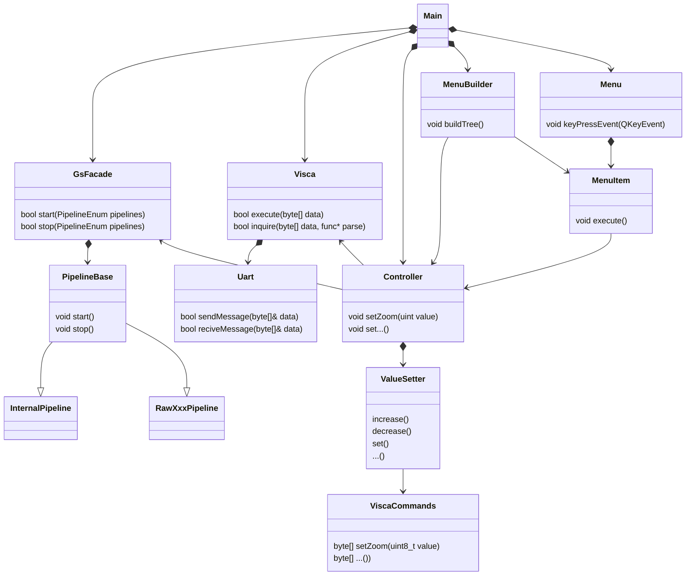
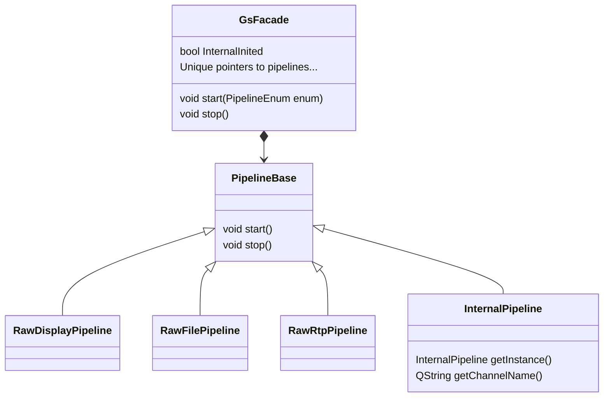
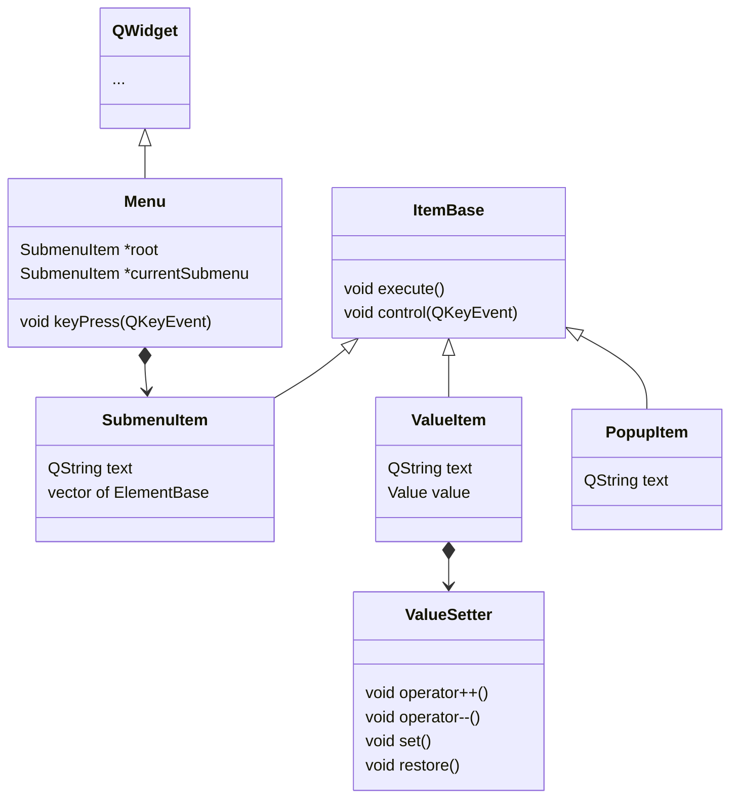
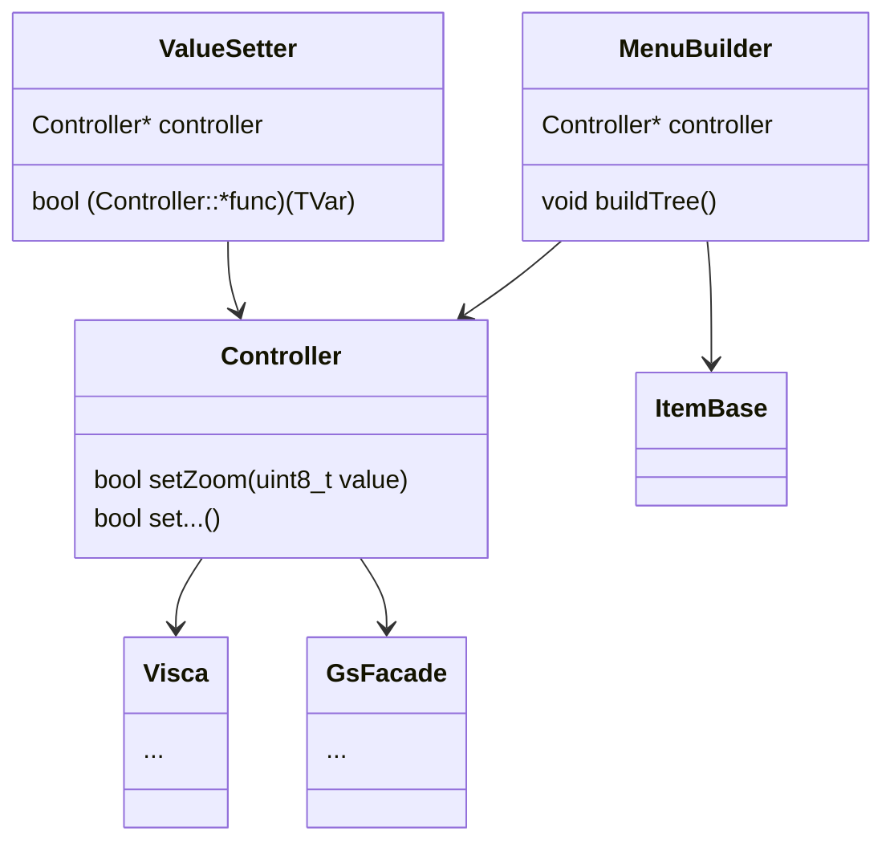

# Dokumentace

[TOC]

## Příprava

*Kvůli časové náročnosti přípravy se nejedná o step by step příručku. Snažil jsem se ale aby žádné podstatné kroky nebyly vynechány.*

**Potřebné vybavení:**

* Nosná deska (v mém případě Trenz TE0701)
* Modul Trenz TE0820 obsahující MPSOC Zynq Ultrascale+
* SD karta, mini-USB kabel, Linux PC

### Příprava PetaLinux

V první řadě je potřeba zkompilovat operační systém, který na desce poběží.

V Docker kontejneru tedy spustíme [PetaLinux 2021.2](https://www.xilinx.com/support/download/index.html/content/xilinx/en/downloadNav/embedded-design-tools.html) - příručka se nachází v `setup/docker-petalinux.tar.gz` a pro Docker složku následně zpřístupníme obsah souboru `setup/petalinux.tar.gz`. Jedná se o vytvořený základ pro PetaLinux (vytvoření probíhá viz např. [tento návod](https://www.instructables.com/Getting-Started-With-PetaLinux/)), spolu s vygenerovanou hardwarovou konfigurací pro FPGA.

Po té se ve spuštěné image Petalinux přesenume do obsahu výše zmíněného `setup/petalinux.tar.gz` a provedeme následující řadu příkazů:

```bash
petalinux-config --get-hw-description=hardware/
```

, to nám zmíněnou konfiguraci pro programovatelné hradlové pole.

Následně nastavíme group packages pomocí (v současné chvíli stačí přidat GStreamer a QT):

```bash
petalinux-config -c rootfs
```

PetaLinux vybuldit:

```bash
petalinux-build
```

A zabalit:

```bash
petalinux-package --boot --fsbl images/linux/zynqmp_fsbl.elf --pmufw images/linux/pmufw.elf --atf images/linux/bl31.elf --u-boot images/linux/u-boot.elf --fpga images/linux/system.bit --force
```

Výsledné soubory `boot.scr`, `BOOT.bin` a `image.ub` je potřeba nahrát do boot partition na [vhodně připravenou](https://xilinx-wiki.atlassian.net/wiki/spaces/A/pages/18842385/How+to+format+SD+card+for+SD+boot) SD kartu a do root partiotion rozbalit obsah souboru `rootfs.ext4`.

Nyní stačí vložit SD kartu a desku zapnout.

> Alternativou je bootovat z QSPI paměti. Musíme filesystém přesunout eMMC z SD kartou nabootovaného PetaLinux. A kromě toho je potřeba změna nastavení v konfiguraci před buildem, úprava boot flagů a nahrání boot partition do QSPI přes TFTP serveru.

Když je deska zaplá, tak můžeme použít pro připojení například `minicom`:

```bash
minicom -D /dev/ttyUSB1 -b 115200
```

, kde je ideální vypnout software a hardware flow control (CTRL-A -> o -> Serial Port Setup -> g, f).

Kromě toho ale deska odešle na DisplayPort standradní konzoli.

### Příprava QT

Opět musíme spustit Dockerizovaný PetaLinux pomocí `petalinux-config -c rootfs` přidat ke QT možnost `populate_sdk_qt5`. Následně vybuildit pomocí `petalinux-build -s`, abychom získali vhodné SDK. To ale ještě musíme rozbalit `petalinux-package --sysroot`.

Pokud bychom chtěli kompilovat, tak už můžeme tak, že použijeme `source` na vygenerované prostředí:

```
. ./images/linux/sdk/environment-setup-aarch64-xilinx-linux
```

Protože ale chceme pracovat s QtCreator, tak spustíme `sdk.sh`, který nám prostředí vytvoří ve složce `opt` (to je především abych měl snazší přípravu QtCreatoru jako takového). Dále jsem automatizoval přidávání kitů do QT na Linuxu pomocí skriptu `Import.py`, který stačí spustit s argumentem `zynq.xml` (při zavřeném QtCreatoru). Následně QtCreator budeme muset otevírat trochu nemotorně tímto stylem:

```bash
. /opt/petalinux/2021.2/environment-setup-cortexa72-cortexa53-xilinx-linux
QtCrator
```

A po té v devices ještě vhodně nastavit IP adresu.

### Grafická akcelerace

Jako grafický backend používáme fbdev. K tomu je třeba přidat `libmali-xlnx` driver do rootfs. Následně v souboru `./project-spec/meta-user/conf/petalinuxbsp.conf` tento backend specifikujeme (přidáme na konec souboru řádek).

```
MALI_BACKEND_DEFAULT = "wayland"
```

Aby se nám spouštěly qt aplikace s GPU akcelerací, je potřeba nastavit proměnné `QT_QPA_EGLFS_INTEGRATION` a `QT_QPA_PLATFORM`. Abychom tento proces zautomatizovali, vytvoříme nový recept `./project-spec/meta-user/recipes-core/base-files/base-files_%.bbappend`, který tyto proměnné zapíše do `.profile`.

```
do_install_append () {
        cat >> ${D}${sysconfdir}/skel/.profile <<EOF
export QT_QPA_EGLFS_INTEGRATION=none
export QT_QPA_PLATFORM=eglfs
EOF
}
```

### Příprava ZCU104

Finální krok přípravy je potom nastavit proměnné pro správné zobrazení na PetaLinux

``` bash
export QT_QPA_PLATFORM=eglfs
export QT_QPA_EGLFS_INTEGRATION=eglfs_kms
export QT_QPA_EGLFS_KMS_CONFIG=/opt/eglfsconfig.json
# export QT_QPA_EGLFS_LAYER_INDEX=36
```

Přičemž zmíněný config bude vypadat následovně, **eglfsconfig.json:**

``` json
{
  "device": "/dev/dri/card1",
  "hwcursor": false,
  "pbuffers": true,
  "outputs": [
    {
      "name": "HDMI1",
      "mode": "3840x2160",
    }
  ]
}
```

---

## Přehled

Takto vypadá objektový návrh celého programu, všechny části jsou detailně popsány níže.



Ve stručnosti ale jde o tři velké moduly - **GStreamer**, **Visca** a **Menu**. Přičemž všechny moduly jsou propojeny díky třídě `Controller`.

---

## Stream obrazu

První částí po přípravě je zobrazení obrazu z kamery (a případné uložení čí odeslání jinam) - k tomu jsem se rozhodl využít GStreamer. A s obrazem pracuji v RAW formě. 

### Testování streamu bez kamery

Pro snazší debug lze použít obraz z TPG - test pattern generátoru (obraz generovaný z FPGA). Pracuji s ním ale stejně, jako bych pracoval s obrazem z kamery, jednoduše pomocí `video4linux` využiji obraz z `/dev/video0`.

#### Setup TPG

Abych test pattern generátor mohl využívat je provést následující přípravu:

```bash
media-ctl -d /dev/media0 -V '5:0 [fmt:RBG888_1X24/3840x2160@1/60 field:none]'
v4l2-ctl -d /dev/video0 --set-fmt-video=width=1024,height=768,pixelformat='RGB3'
yavta --no-query -w '0x009e0901 30' /dev/v4l-subdev0
yavta --no-query -w '0x009e0902 304' /dev/v4l-subdev0
yavta --no-query -w '0x009f0903 0' /dev/v4l-subdev0
yavta --no-query -w '0x0098c912 1' /dev/v4l-subdev0
```

### GStreamer z příkazové řádky

GStreamer se dá kromě pomocí C++ dá využít i prostřednictvím příkazové řádky. Takto tedy vypadá příkaz pro ukládání obrazu na **SD kartu**.

```bash
# Odeslání
gst-launch-1.0 v4l2src ! video/x-raw, width=3840, height=2160, framerate=30/1, format=RGB !  filesink location=/media/sd-mmcblk1p2/video-raw-file

# Zobrazení
gst-launch-1.0 filesrc location=video-raw-file ! rawvideoparse width=3840 height=2160 format=RGB framerate=30/1 ! autovideoconvert ! autovideosink
```

A toto je výsledek:


Další nezbytná část je odesílání obrazu po RTP. Opět velmi jednoduchá pipeline, kde před odeslání stačí data zabalit pomocí rtpvrawpay.

```bash
# Odeslání
gst-launch-1.0 v4l2src device=/dev/video0 ! video/x-raw,width=3840,height=2160, framerate=30/1 ! queue ! rtpvrawpay ! udpsink host=<ip adresa> port=5000 sync=false async=false

# Zobrazení
gst-launch-1.0 udpsrc port=5000 caps = "application/x-rtp, media=(string)video, clock-rate=(int)90000, encoding-name=(string)RAW, sampling=(string)RGB, depth=(string)8, width=(string)3840, height=(string)2160, colorimetry=(string)SMPTE240M, payload=(int)96, ssrc=(uint)2795573110, timestamp-offset=(uint)1410027821, seqnum-offset=(uint)15167, a-framerate=(string)30" ! rtpvrawdepay ! queue ! videoconvert ! autovideosink
```

A závěrečná pipeline pro výstup na monitor:

```bash
gst-launch-1.0 v4l2src io-mode=dmabuf ! video/x-raw, width=3840, height=2160, framerate=30/1, format=RGB ! queue ! kmssink fullscreen-overlay=1

# S využitím videomixer modulu
gst-launch-1.0 v4l2src device=/dev/video0 io-mode=4 ! queue ! videoconvert ! videoscale ! video/x-raw,width=3840,height=2160,framerate=30/1,format=RGB ! kmssink bus-id="a0000000.v_mix" plane-id=37 fullscreen-overlay=false sync=false

```

### Realizace v C++

Kromě bežných věcí při převodu do C++ jako například že je potřeba řešit destrukci a objektový návrh, je největší komplikace, že nyní budu schopen využívat více pipelines z jednoho zdroje. Zde jsem využil plugin z balíčku bad a k tomu využívám `intervideosrc` a `intervideosink`. Nejdříve se připravím interní pipeline, která video z kamery předává do `intervideosink` a z něj ho následně využívají ostatní pipelines.

### Objektový návrh



> Zde je otázka, zda opravdu všechny druhy pipeline potřebují vlastní třídu. Dle mého názoru by mohly být na tolik odlišené, že se toto oddělení vyplatí.

---

## Uživatelské rozhraní

Pro propojení obrazu z GStreameru a menu vytvořeném v QT využiji modul zvaný video-mixer, ten spojí několik poloprůhledných vrstev do jednoho obrazu.

### Menu z Qt

Jelikož mnou navrhnutá struktura menu bude pravděpodobně využita i v jiných produktech, rozhodl jsem se pro více rigidní a generický návrh. Ten stojí na třídě `Menu`, která dědí od `QWidget`. Třída `Menu` si ale především stromovitě drží celou strukturu položek. 

V podstatě se v případě jednotlivých položek menu jedná o návrhový vzor kompozit - buď je to list a tedy položka, která něco vykonává, a nebo jen další submenu. O vybudování toho stromu se pak stará třída `MenuBuilder`, ta kromě položky v menu je nalinkuje s metodami ve třídě `Controller`.



Chování execute se pak u jednotlivých druhů elementů bude lišit - v případě `SubmenuElement` se pouze změní aktuální submenu, v případě `ValueElement` a `PopupElement` se provede počáteční akce a po té se ovládání nechá na třídách samotných, které po dokončení `Menu` informují, že má opět zpracovávat vstupy od uživatele,

### MenuBuilder

Všechny elementy budou vytvořeny na kořenu prostřednictvím třídy `MenuBuilder`, ta bude držet názvy jednotlivých položek a zároveň je pomocí pointeru propojí s odpovídající položkou na kterou budou mít vliv. Tyto položky se ve většině případů odkazovat na třídu `Controller`, která bude obsahovat všechny podporované příkazy, zároveň s kontrolou rozsahu.




---

## Ovládání kamery

Jak již bylo zmíněno v `README`, ovládání kamery je zajištěně pomocí UART komunikace s použitím tzv. VISCA prtokolu - viz. [dokumentace](https://www.sony.net/Products/CameraSystem/CA/BRC_X1000_BRC_H800/Technical_Document/C456100121.pdf).

Navázat UART komunikaci je díky Linuxu velmi snadné, stačí mi jednoduše otevřít soubor a nastavit `termios` flagy jako např. baud rate. Pro práci se samotným VISCA protkolem je potřeba následně provést ještě dva kroky a to nastavení adresy a vymazání příkazového bufferu.

Komplikovanější je pouze čtení, to řeším tak, že na desriptor ze kterého čtu přidám `select()` s předem nastavenou `timeval` pro případ, že by delší dobu nepřicházela odpověď.

Pro realizaci protokolu jako takového jsem hledal vhodné uložení příkazů. Ve výsledku jsem se rozhodoval mezi použitím builder pattern a více přímočarým řešením `constexpr` metod rozdělených do vhodných `namespace`, které podle argumentu vrací array `uint8_t`. Nakonec jsem se rozhodl pro druhou variantu neboť příkazů není až tak velké množství, je to nepatrně rychlejší a snadněji se přidá nový command - tomu odpovídá třída `ViscaCommands`.

S vzniklým arrayem následně pracuje třída `Visca`, která předá referenci na array třídě `UartCmmunication`, která se stará o samotné odesílání.

Důležité je zmínit i to, že VISCA protokol běží asynchronně na GUI. O to se stará především `Controller` s asynchronně zpracovávanou frontou VISCA příkazů.
