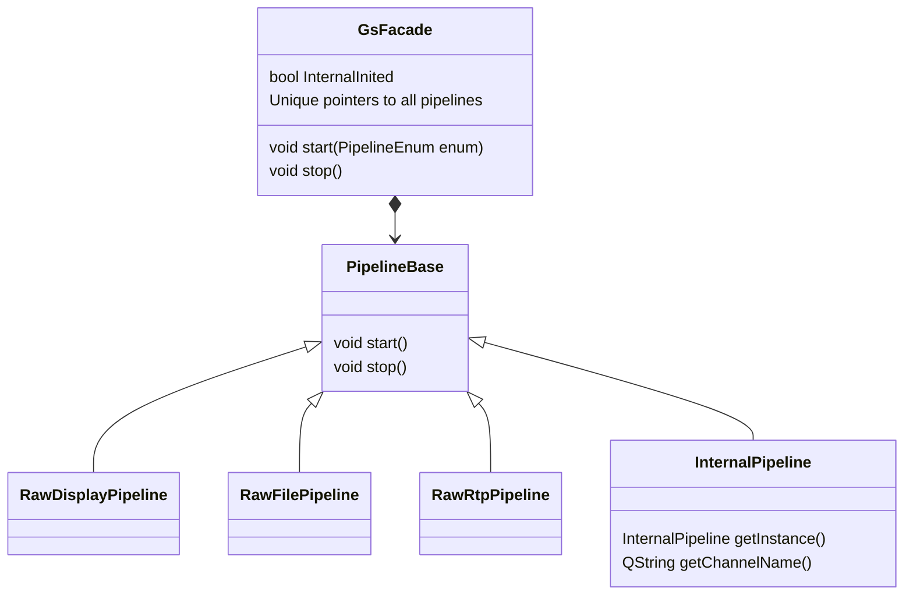
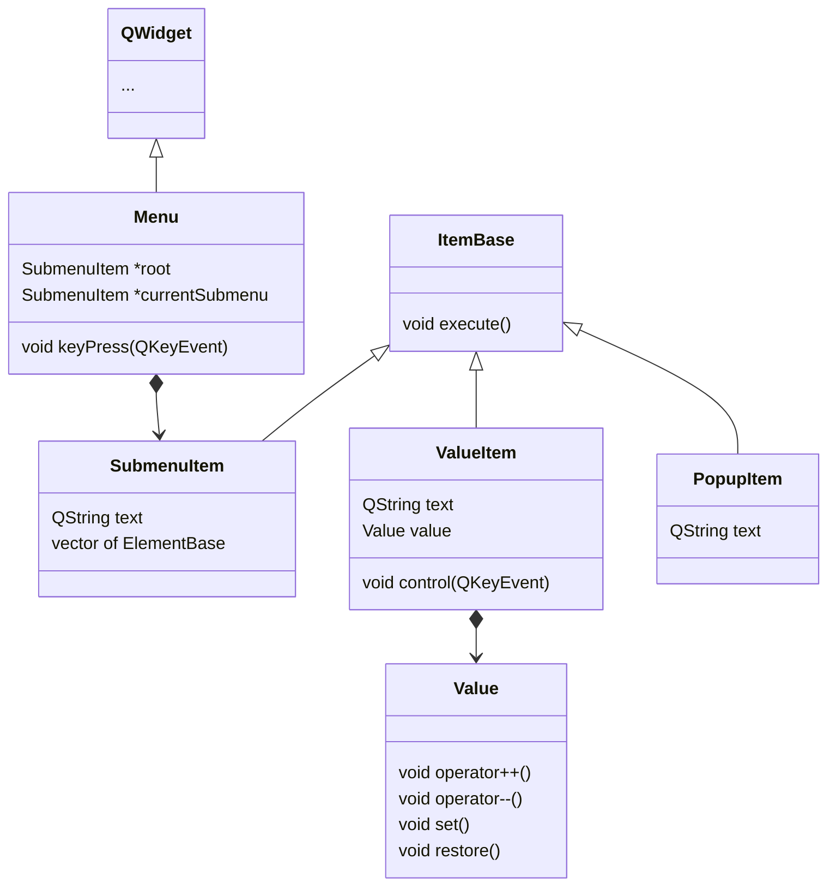
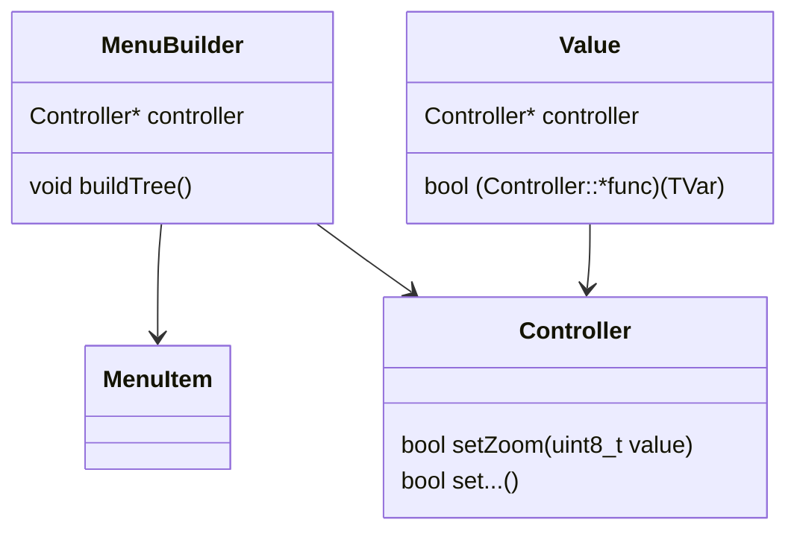
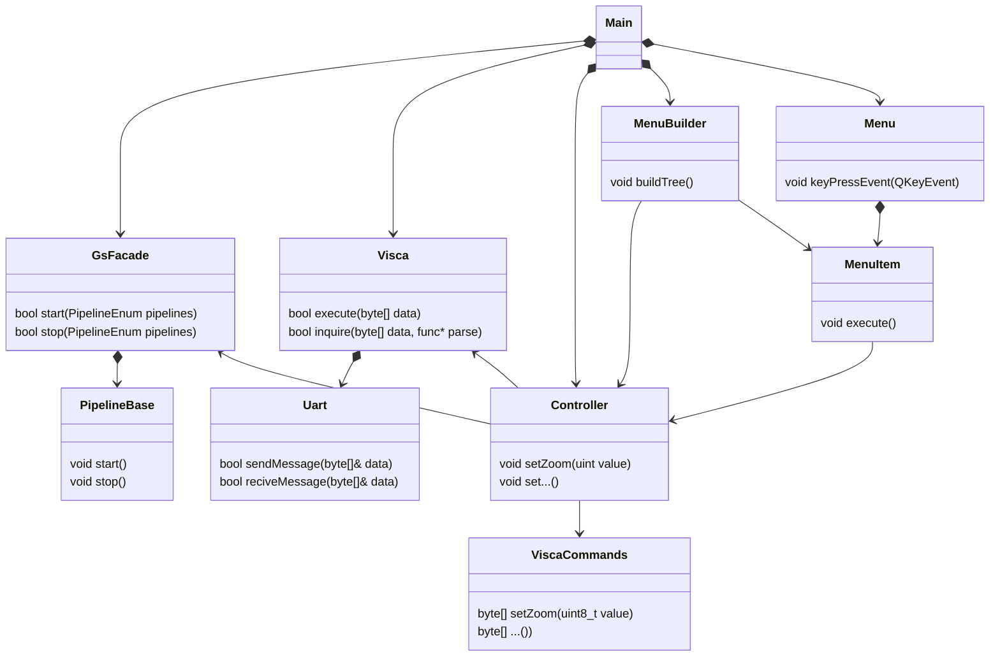

# Development notes

---

[TOC]

## 0. část - Setup

Tato část je na tolik obsáhlá, že jsem ji vyňal a z poznámek a přemístil ji do složky `Setup` spolu se soubory, které k tomu jsou nutné.

## 1. část - Stream obrazu

První částí je zobrazit samotný obraz z kamery a případně jej odeslat i jinam - k tomu jsem se rozhodl využít GStreamer.

S obrazem pracuji v RAW formě - dokončení enkódovacího modulu je relativně problematické. Zároveň pro usnadnění používám obraz z TPG - test pattern generátoru (obraz generovaný z FPGA). Pracuji s ním ale stejně, jako bych pracoval s obrazem z kamery, jednoduše pomocí `video4linux` využiji obraz z `/dev/video0`.

### Setup TPG

Abych test pattern generátor mohl využívat je provést následující přípravu:

```bash
media-ctl -d /dev/media0 -V '5:0 [fmt:RBG888_1X24/1024x768@1/60 field:none]'
v4l2-ctl -d /dev/video0 --set-fmt-video=width=1024,height=768,pixelformat='RGB3'

yavta --no-query -w '0x009e0901 30' /dev/v4l-subdev0
yavta --no-query -w '0x009e0902 304' /dev/v4l-subdev0
yavta --no-query -w '0x009f0903 0' /dev/v4l-subdev0
yavta --no-query -w '0x0098c912 1' /dev/v4l-subdev0
```

### GStreamer z příkazové řádky

GStreamer se dá kromě pomocí C++ dá využít i prostřednictvím příkazové řádky. Takto tedy vypadá příkaz pro ukládání obrazu na **SD kartu**.

```bash
gst-launch-1.0 v4l2src ! video/x-raw, width=1024, height=768, framerate=60/1, format=RGB !  filesink location=/media/sd-mmcblk1p2/video-raw-file
```

#### Náhled uloženého obrazu

Pro spuštění nebo enkódování vzniklého videa lez využít následující příkazy:

```bash
gst-launch-1.0 filesrc location=video-raw-file ! rawvideoparse width=1024 height=768 format=16 framerate=60/1 ! autovideoconvert ! autovideosink

gst-launch-1.0 filesrc location=video-raw-file ! rawvideoparse width=1024 height=768 format=16 framerate=60/1 ! autovideoconvert ! x264enc ! mp4mux ! filesink location=tpg.mp4
```

A toto je výsledek:


#### Stream přes RTP

Další nezbytná část je odesílání obrazu po RTP. Opět velmi jednoduchá pipeline, kde před odeslání stačí data zabalit pomocí rtpvrawpay.

```bash
gst-launch-1.0 v4l2src ! video/x-raw, width=1024, height=768, framerate=60/1, format=RGB ! rtpvrawpay ! udpsink port=9002 host=10.15.1.77

gst-launch-1.0 udpsrc port="9002" caps = "application/x-rtp, media=(string)video, width=(string)1024, framerate=(fraction)60/1, height=(string)768, format=(string)RGB" ! rtpvrawdepay ! videoconvert ! autovideosink
```

#### Zobrazení na obrazovku

A závěrečná pipeline pro výstup na monitor:

```bash
gst-launch-1.0 v4l2src io-mode=dmabuf ! video/x-raw, width=1024, height=768, framerate=60/1, format=RGB ! queue ! kmssink fullscreen-overlay=1
```

### Realizace v C++

Kromě bežných věcí při převodu do C++ jako například že je potřeba řešit destrukci a objektový návrh, je největší komplikace, že nyní budu schopen využívat více pipelines z jednoho zdroje. Zde jsem využil plugin z balíčku bad a k tomu využívám `intervideosrc` a `intervideosink`. Nejdříve se připravím interní pipeline, která video z kamery předává do `intervideosink` a z něj ho následně využívají ostatní pipelines.

#### Pozn. k RTP

Určitá problematická část je nastavování IP adresy - to se pravděpodobně bude v budoucnu nastavovat UI.
V praxi nebudu navíc odesílat raw video, protože s vyšším rozlišením to nebude možné.

### Objektový návrh



> Zde je otázka, zda opravdu všechny druhy pipeline potřebují vlastní třídu. Dle mého názoru by mohly být na tolik odlišené, že se toto oddělení vyplatí.

## 2. část - Uživatelské rozhraní

Pro propojení obrazu z GStreameru a menu vytvořeném v QT využiji čipu zvaný video-mixer, ten data odeslaná do jednotlivých vrstev `kmssink` spojí. 

### Menu

Jelikož mnou navrhnutá struktura menu bude pravděpodobně využita i v jiných produktech, rozhodl jsem se pro více rigidní návrh. Ten stojí na třídě `Menu`, která dědí od `QWidget`, a ta si stromovitě drží celou strukturu menu. 

V podstatě se v případě jednotlivých položek menu jedná o návrhový vzor kompozit - buď je to list a tedy položka, která něco vykonává, a nebo jen další submenu. O vybudování toho stromu se pak stará třída `MenuBuilder`, ta kromě položky v menu je nalinkuje s metodami ve třídě `Controller`.



Chování execute se pak u jednotlivých druhů elementů bude lišit - v případě `SubmenuElement` se pouze změní aktuální submenu, v případě `ValueElement` a `PopupElement` se provede počáteční akce a po té se ovládání nechá na třídách samotných, které po dokončení `Menu` informují, že má opět zpracovávat vstupy od uživatele,

### MenuBuilder

Všechny elementy budou vytvořeny na kořenu prostřednictvím třídy `MenuBuilder`, ta bude držet názvy jednotlivých položek a zároveň je pomocí pointeru propojí s odpovídající položkou na kterou budou mít vliv. Tyto položky se ve většině případů odkazovat na třídu `Controller`, která bude obsahovat všechny podporované příkazy, zároveň s kontrolou rozsahu.




## 3. část - ovládání kamery

Jak již bylo zmíněno v `README`, ovládání kamery je zajištěně pomocí UART komunikace s použitím tzv. VISCA prtokolu - viz. [dokumentace](https://www.sony.net/Products/CameraSystem/CA/BRC_X1000_BRC_H800/Technical_Document/C456100121.pdf).

> Tuto část jsem začal dělat v době, kdy jsem ještě neměl přístup ke všemu HW a tedy jsem využil jinou desku a jinou kameru. V rychlosti jsem tedy vytvořil nový projekt s nějakým základním zobrazení pomocí RTP. Ten nyní nese označení `visca_test [temp]`

Navázat UART komunikaci je díky Linuxu velmi snadné, stačí mi jednoduše otevřít soubor `/dev/ttymxc4` a nastavit termios flagy jako např. baud rate. Pro práci se samotným VISCA protkolem je potřeba následně provést ještě dva kroky a to nastavení adresy a vymazání příkazového bufferu.

Pro realizaci protokolu jako takového jsem hledal vhodné uložení příkazů. Ve výsledku jsem se rozhodoval mezi použitím builder pattern a více přímočarým řešením constexpr metod rozdělených do vhodných namespace, které podle argumentu vrací array `uint8_t`. Nakonec jsem se rozhodl pro druhou variantu neboť příkazů není až tak velké množství, je to nepatrně rychlejší a snadněji se přidá nový command - tomu odpovídá třída `ViscaCommands`.

S vzniklým arrayem následně pracuje třída `Visca`, která předá referenci na array třídě `UartCmmunication`, která se stará o samotné odesílání.

## Přehled

Dosti zjednodušený pohled na objektový návrh programu:



