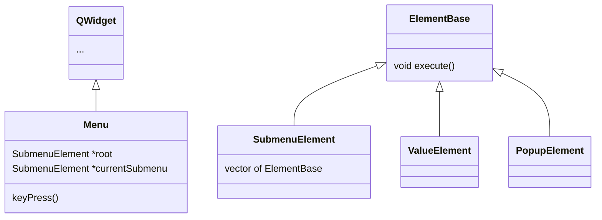

# Development notes

*Zde si budu psát předběžné poznámky k vývoji*

---

[TOC]

---

## 1. část - uložení generovaného obrazu na SD kartu

### Setup

Před použitím gstreameru je nutný setup pro video for linux. 

```bash
media-ctl -d /dev/media0 -V '5:0 [fmt:RBG888_1X24/1024x768@1/60 field:none]'
v4l2-ctl -d /dev/video0 --set-fmt-video=width=1024,height=768,pixelformat='RGB3'

yavta --no-query -w '0x009e0901 30' /dev/v4l-subdev0
yavta --no-query -w '0x009e0902 304' /dev/v4l-subdev0
yavta --no-query -w '0x009f0903 0' /dev/v4l-subdev0
yavta --no-query -w '0x0098c912 1' /dev/v4l-subdev0
```

> Pozn. pro jednoduchost dočasně využívám nižší rozlišení

### Příkazová řádka

V tuto chvíli jsem zprovoznil uložení jako na SD kartu z příkazové řádky

```bash
gst-launch-1.0 v4l2src ! video/x-raw, width=1024, height=768, framerate=60/1, format=RGB !  filesink location=/media/sd-mmcblk1p2/video-raw-file
```

### Raw náhled

Pro spuštění nebo enkódování vzniklého videa můžu využít následující příkazy:

```bash
gst-launch-1.0 filesrc location=video-raw-file ! rawvideoparse width=1024 height=768 format=16 framerate=60/1 ! autovideoconvert ! autovideosink

gst-launch-1.0 filesrc location=video-raw-file ! rawvideoparse width=1024 height=768 format=16 framerate=60/1 ! autovideoconvert ! x264enc ! mp4mux ! filesink location=tpg.mp4
```

Výsledek:


### Stream přes RTP

Opět velmi jednoduchá pipeline, kde před odeslání stačí data zabalit pomocí rtpvrawpay.

Příkazová řádka:

```bash
gst-launch-1.0 v4l2src ! video/x-raw, width=1024, height=768, framerate=60/1, format=RGB ! rtpvrawpay ! udpsink port=9002 host=10.15.1.77

gst-launch-1.0 udpsrc port="9002" caps = "application/x-rtp, media=(string)video, width=(string)1024, framerate=(fraction)60/1, height=(string)768, format=(string)RGB" ! rtpvrawdepay ! videoconvert ! autovideosink
```

### Realizace v C++

Kromě zjevných věcí jako například že je potřeba řešit destrukci a objektový návrh, je největší komplikace více pipelines z jednoho zdroje. Zde jsem využil plugin z balíčku bad (GStreamer má tři úrovně pluginů - good, bad a ugly) a k těmto účelům využívám tzv. `intervideosrc` a `intervideosink`. Nejdříve se připravím interní pipeline, která video z kamery předává do `intervideosink` a z něj ho následně můžou využít i ostatní pipelines.

#### Pozn. k RTP

Určitá problematická část je nastavování IP adresy - to se pravděpodobně bude v budoucnu nastavovat UI.
V praxi nebudu navíc odesílat raw video, protože s vyšším rozlišením to nebude možné.

## 2. část - zobrazení

Potřeba přidat další GStreamer pipeline.

### KMS sink

Obodobně jako v případě minulých pipelines jsem vytvořil pipeline takovou, která data z `intervideosrc` předává do `kmssink`.

### Zobrazení s uživatelským rozhraním

Zatím nebylo nutné. V praxi se bude používat hardwarový čip zvaný video mixer - ten spojí obraz uživatelského rozhraní a výstupu z kamery.

## 3. Část - menu

Jelikož mnou navrhnutá struktura menu bude pravděpodobně využita i v jiných produktech, rozhodl jsem se pro více rigidní návrh. Ten stojí na třídě `Menu`, která je zároveň `QWidget`, která si stromovitě drží celou strukturu menu přes kořenový element, který reprezentuje sumbenu.

...



...

## 4. část - ovládání kamery

Jak již bylo zmíněno v `README`, ovládání kamery je zajištěně pomocí UART komunikace s použitím tzv. VISCA prtokolu - viz. [dokumentace](https://www.sony.net/Products/CameraSystem/CA/BRC_X1000_BRC_H800/Technical_Document/C456100121.pdf).

> Tuto část jsem začal dělat v době, kdy jsem ještě neměl přístup ke všemu HW a tedy jsem využil jinou desku a jinou kameru. V rychlosti jsem tedy vytvořil nový projekt s nějakým základním zobrazení pomocí RTP. Ten nyní nese označení `visca_test [temp]`

Navázat UART komunikaci je díky Linuxu velmi snadné, stačí mi jednoduše otevřít soubor `/dev/ttymxc4` a nastavit termios flagy jako např. baud rate. Pro práci se samotným VISCA protkolem je potřeba následně provést ještě dva kroky a to nastavení adresy a vymazání příkazového bufferu.

Pro realizaci protokolu jako takového jsem hledal vhodné uložení příkazů. Ve výsledku jsem se rozhodoval mezi použitím builder pattern a více přímočarým řešením constexpr metod rozdělených do vhodných namespace, které podle argumentu vrací array `uint8_t`. 

Nakonec jsem se rozhodl pro druhou variantu neboť příkazů není až tak velké množství, je to nepatrně rychlejší a snadněji se přidá nový command.

S vzniklým arrayem následně pracuje třída `Visca`, která předá referenci na array třídě `UartCmmunication`, která se stará o samotné odesílání.
